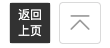

# TinyButton

>
> 适用于AppContainer的底部操作栏的按钮组件
> 
> 
> 

## Props

|字段名|类型|是否必填|说明|
|:----|:----|:----|:----|
|iconClass|string|是|iconfont上对应的图标名（无需额外写多一个"iconfont"）|
|content|string|是|展示的文字，一定要4个中文字符|

## Events

|事件名|参数|说明|
|:----|:----|:----|
|click||点击按钮触发的事件|

## 示例

```vue
<template>
  <tiny-button
    icon-class="xbicon-backpage"
    content="返回上页"
    @click="goBack"
  ></tiny-button>
</template>
```