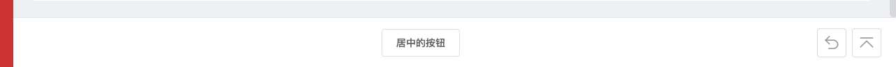
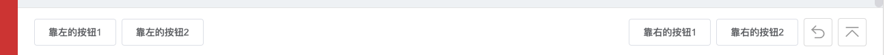

# PageContainer

>
> 基础页面布局，主要包含了底部操作栏，以及大概的页面布局(包括滚动条)
> 
> ----
> 
> ###### 更新日志
> 2021-5-15: props增加了 `hideBottomBar`，用于强制隐藏底部操作栏  
> 2021-5-17: 样式调整了一下，PageContainer的下一级任意元素（除了最后一个），默认增加了一个`margin-bottom`
> 

## Props

|字段名|类型|是否必填|说明|
|:----|:----|:----|:----|
|showGoBack|boolean|否|是否展示返回按钮|
|goBackMethod|function|否|自定义的返回逻辑|
|hideBackToTop|boolean|否|是否隐藏"回到顶部"|
|hideBottomBar|boolean|否|是否隐藏底栏（这个权限最大）|

## Slots

|插槽名|说明|
|:----|:----|
|default|默认插槽，安置主要内容|
|bottomBarCenter|居中的摆放位置，优先级最高|
|bottomBarLeft|居左的摆放位置|
|bottomBarRight|居右的摆放位置|

### 注意事项

- 当`bottomBarCenter`, `bottomBarLeft`, `bottomBarRight`插槽有值时，会展示底部操作栏
- 当`showGoBack`为true或`goBackMethod`有传入自定义返回逻辑时，也会展示底部操作栏
- 当`hideBottomBar`设置为true时，无论如何都不会展示底栏！
- 当底部操作栏展示时，设置栏`hideBackToTop`为true，就可以隐藏"回到顶部"按钮
- `bottomBarCenter`的优先级最高，当设置了`bottomBarCenter`之后，无论`bottomBarLeft`和`bottomBarRight`里插入了什么值，都不会显示出来
- `bottomBarLeft`, `bottomBarRight`中，对每个下一级元素都设定了margin值，所以不需要额外再写（除非有特殊设计稿）

## 示例

#### 1. 插入中间操作栏



```vue
<template>
  <page-container show-go-back>
    <div>我是业务逻辑</div>
    <template v-slot:bottomBarCenter>
      <el-button>居中的按钮</el-button>
    </template>
  </page-container>
</template>
<script>
import PageContainer from '_c/PageContainer'
export default {
  components: { PageContainer }
}
</script>
```

#### 2. 插入左右的操作栏



```vue
<template>
  <page-container show-go-back>
    <div>我是业务逻辑</div>
    <template v-slot:bottomBarLeft>
      <el-button>靠左的按钮1</el-button>
      <el-button>靠左的按钮2</el-button>
    </template>
    <template v-slot:bottomBarRight>
      <el-button>靠右的按钮1</el-button>
      <el-button>靠右的按钮2</el-button>
    </template>
  </page-container>
</template>
<script>
import PageContainer from '_c/PageContainer'
export default {
  components: { PageContainer }
}
</script>
```

#### 3. 当插入了中间操作栏后，左右操作栏的代码将不会生效


```vue
<template>
  <page-container show-go-back>
    <div>我是业务逻辑</div>
    <template v-slot:bottomBarCenter>
      <el-button>居中的按钮</el-button>
    </template>
    <template v-slot:bottomBarLeft>
      <el-button>靠左的按钮1</el-button>
      <el-button>靠左的按钮2</el-button>
    </template>
    <template v-slot:bottomBarRight>
      <el-button>靠右的按钮1</el-button>
      <el-button>靠右的按钮2</el-button>
    </template>
  </page-container>
</template>
<script>
import PageContainer from '_c/PageContainer'
export default {
  components: { PageContainer }
}
</script>
```