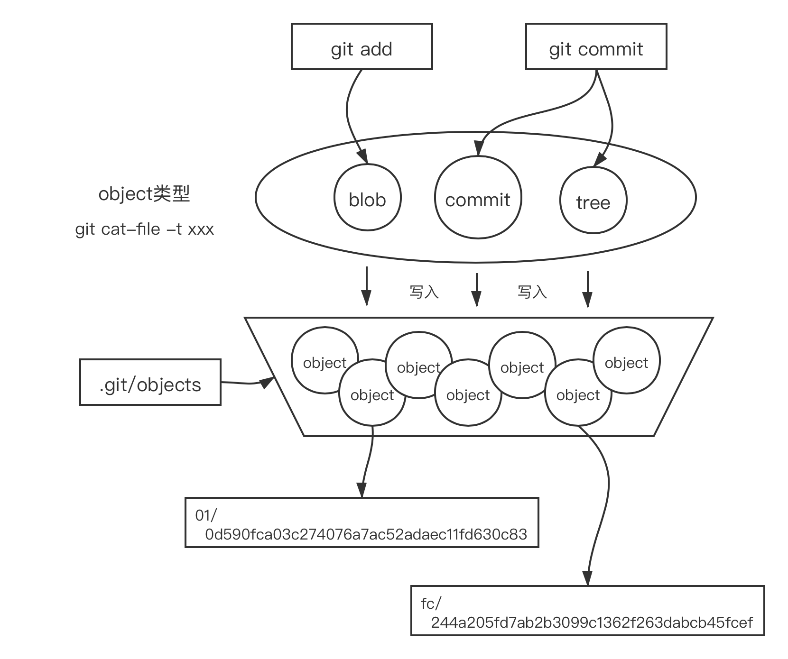

# Base


## .git目录
``` bash
$ git init
Initialized empty Git repository in D:/yiki/git-test/.git/
$ ls -al
total 8
drwxr-xr-x 1 xinbao 197121 0 Nov  2 13:59 ./
drwxr-xr-x 1 xinbao 197121 0 Nov  2 13:59 ../
drwxr-xr-x 1 xinbao 197121 0 Nov  2 13:59 .git/
$ cd .git
$ ls
config       hooks/  info/  objects/ HEAD description  index   logs/  refs/

------------------------
./git
  ├── HEAD                    points to the branch you currently have checked out
  ├── index                   Git stores your staging area information
  ├── branches
  ├── config                  project-specific configuration options /邮箱/用户名 --- git cofig...
  ├── description             used only by the GitWeb program
  ├── hooks                   hook scripts, which are discussed in detail in Git Hooks. --- pre-push
  │ ├── pre-commit.sample
  │ ├── pre-push.sample
  │ └── ...
  ├── info                    
  │ └── exclude               global exclude file for ignored patterns --- .gitignore
  ├── objects                 core 
  │ ├── info
  │ └── pack
  └── refs                    pointers into commit objects in that data (branches, tags, remotes and more)
    ├── heads             
    └── tags
    └── remotes
```
- file `config`
``` bash
$ cat config
[core]
        repositoryformatversion = 0
        filemode = false
        bare = false
        logallrefupdates = true
        symlinks = false
        ignorecase = true
```

## objects
::: tip
Git is a content-addressable(内容寻址) filesystem. It means that at the core of Git is a simple key-value data store. What this means is that you can insert any kind of content into a Git repository, for which Git will hand you back a unique key you can use later to retrieve that content.
:::

- 每次你创建一个文件，并追踪它，git 都将把文件进行压缩并存储在自己的数据结构中。
- 被压缩的对象将具有唯一的名称和 hash 值，并将存储到对象 (object) 目录中，此目录中每个文件都是 `SNAPSHOT`（快照）
- git中每一个实体以一个 `40字符长度的十六进制字符串来唯一标识`
``` bash
MINGW64 /d/yiki/git-test/.git 
$ ls objects
info/  pack/
MINGW64 /d/yiki/git-test/.git 
$ cd ..
MINGW64 /d/yiki/git-test (master)
$ touch 1.text
MINGW64 /d/yiki/git-test (master)
$ git add .
MINGW64 /d/yiki/git-test (master)
$ git commit -m 'add1'
[master (root-commit) cd1aeaf] add1
 1 file changed, 0 insertions(+), 0 deletions(-)
 create mode 100644 1.text
MINGW64 /d/yiki/git-test (master)
$ ls .git/objects
a5/  cd/  e6/  info/  pack/     // 多了a5-tree/ cd-commit log/ e6-file/
...
MINGW64 /d/yiki/git-test
$ find .git/objects -type f
.git/objects/70/30efb5d07c73bd6e4885c9686760eb6e6edc9c
.git/objects/a5/6bcbd1b3681262c1b2023d3cbf765c37d8a4d8      // a5-tree
.git/objects/cd/1aeaf5a4f969673aeb385d211e2615c4f6e280      // cd-commit log
.git/objects/e3/6dc774e5546c8ea5bf9687447a3b95d14caa12
.git/objects/e6/9de29bb2d1d6434b8b29ae775ad8c2e48c5391      // blob SHA1

```
- `git cat-file -p ` Once you have content in your object database, you can examine that content with the git cat-file command，` -p ` figure out the type of content,
- after ur commit
``` bash
MINGW64 /d/yiki/git-test (master)
$ git log
commit cd1aeaf5a4f969673aeb385d211e2615c4f6e280 (HEAD -> master)
Author: liyiki <liyiqi@xinpayroll.com>
Date:   Tue Nov 2 14:14:48 2021 +0800

    add1

MINGW64 /d/yiki/git-test (master)
$ git cat-file -p cd1aeaf5a4f969673aeb385d211e2615c4f6e280

// 得到以下内容
tree a56bcbd1b3681262c1b2023d3cbf765c37d8a4d8     //快照的哈希值
author liyiki <liyiqi@xinpayroll.com> 1635833688 +0800   //作者信息和提交的注释
committer liyiki <liyiqi@xinpayroll.com> 1635833688 +0800
add1

// 查看快照 是我们添加的文件
MINGW64 /d/yiki/git-test (master)
$ git cat-file -p a56bcbd1b3681262c1b2023d3cbf765c37d8a4d8
100644 blob e69de29bb2d1d6434b8b29ae775ad8c2e48c5391    1.text

```
## HEAD
- 指向你正在使用的分支的顶端的指针
- Git有一种特殊的引用，称为`符号引用（Symbolic References）`
- `HEAD`就是一个符号引用
``` bash
$ cat HEAD
ref: refs/heads/master
```
- 分支 ( branch) 和标签 (tag) 只不过是一个指向提交的指针。这就意味着，即使你删掉了你要删除的分支和标签，他们指向的提交依然还在那里，只不过删除后难获取这些提交更困难一些

## ref
::: tip
it would be easier if you had a file in which you could store that SHA-1 value under a simple name so you could use that simple name rather than the raw SHA-1 value.
::: 

## summary

- 每个commit都是git仓库的一个`快照`
  - commit是对象关系图的入口
  - tree对象用于描述目录结构，每个目录节点都会用一个tree对象表示。目录间、目录文件间的层次关系会在tree对象的内容中体现
  - 每个commit都会有一个root tree对象
  - blob对象为tree的叶子节点，它的内容即为文件的内容
- when you run the `git add` and `git commit` commands, it...
  - stores blobs for the files that have changed
  - updates the index(for staging area)
  - writes out trees
  - writes commit objects that reference the top-level trees
