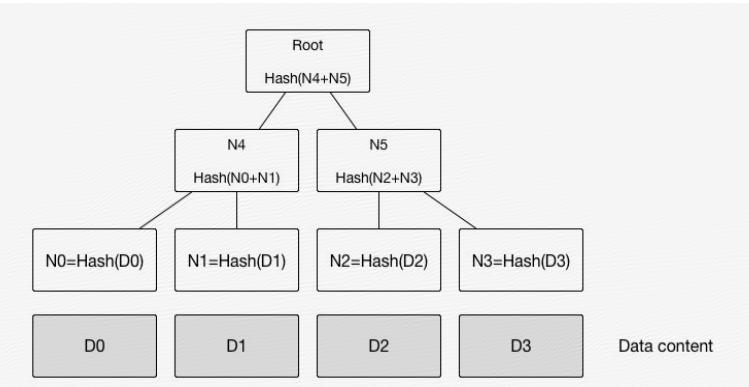

# Base


## .git目录
``` bash
$ git init
Initialized empty Git repository in D:/yiki/git-test/.git/
$ ls -al
total 8
drwxr-xr-x 1 xinbao 197121 0 Nov  2 13:59 ./
drwxr-xr-x 1 xinbao 197121 0 Nov  2 13:59 ../
drwxr-xr-x 1 xinbao 197121 0 Nov  2 13:59 .git/
$ cd .git
$ ls
HEAD  config  description  hooks/  info/  objects/  refs/
------------------------
./git
 ├── HEAD
    ├── branches
    ├── config                  仓库配置/邮箱/用户名 --- git cofig...
    ├── description             仓库的描述
    ├── hooks                   git钩子 如pre-push
    │ ├── pre-commit.sample
    │ ├── pre-push.sample
    │ └── ...
    ├── info                    
    │ └── exclude
    ├── objects                 文件压缩并放进去 -- 文件哈希值添加进快照
    │ ├── info
    │ └── pack
    └── refs
     ├── heads
     └── tags
```
- file `config`
``` bash
$ cat config
[core]
        repositoryformatversion = 0
        filemode = false
        bare = false
        logallrefupdates = true
        symlinks = false
        ignorecase = true
```

## commit 和 /objects

- 每次你创建一个文件，并追踪它，git 都将把文件进行压缩并存储在自己的数据结构中。
- 被压缩的对象将具有唯一的名称和 hash 值，并将存储到对象 (object) 目录中
- git中每一个实体以一个 `40字符长度的十六进制字符串来唯一标识`
``` bash
MINGW64 /d/yiki/git-test/.git 
$ ls objects
info/  pack/
MINGW64 /d/yiki/git-test/.git 
$ cd ..
MINGW64 /d/yiki/git-test (master)
$ touch 1.text
MINGW64 /d/yiki/git-test (master)
$ git add .
MINGW64 /d/yiki/git-test (master)
$ git commit -m 'add1'
[master (root-commit) cd1aeaf] add1
 1 file changed, 0 insertions(+), 0 deletions(-)
 create mode 100644 1.text
MINGW64 /d/yiki/git-test (master)
$ ls .git/objects
a5/  cd/  e6/  info/  pack/     // 多了a5-tree/ cd-commit log/ e6-file/
...
MINGW64 /d/yiki/git-test/.git/objects 
$ ls a5                                  // a5-tree
6bcbd1b3681262c1b2023d3cbf765c37d8a4d8   
$ ls cd                                  // cd-commit log
1aeaf5a4f969673aeb385d211e2615c4f6e280
$ ls e6                                 // blob SHA1
9de29bb2d1d6434b8b29ae775ad8c2e48c5391

```
- 你的提交会发生
``` bash
MINGW64 /d/yiki/git-test (master)
$ git log
commit cd1aeaf5a4f969673aeb385d211e2615c4f6e280 (HEAD -> master)
Author: liyiki <liyiqi@xinpayroll.com>
Date:   Tue Nov 2 14:14:48 2021 +0800

    add1

MINGW64 /d/yiki/git-test (master)
$ git cat-file -p cd1aeaf5a4f969673aeb385d211e2615c4f6e280

// 得到以下内容
tree a56bcbd1b3681262c1b2023d3cbf765c37d8a4d8     //快照的哈希值
author liyiki <liyiqi@xinpayroll.com> 1635833688 +0800   //作者信息和提交的注释
committer liyiki <liyiqi@xinpayroll.com> 1635833688 +0800
add1

// 查看快照 是我们添加的文件
MINGW64 /d/yiki/git-test (master)
$ git cat-file -p a56bcbd1b3681262c1b2023d3cbf765c37d8a4d8
100644 blob e69de29bb2d1d6434b8b29ae775ad8c2e48c5391    1.text

```
## summary

- 每个commit都是git仓库的一个`快照`
  - commit是对象关系图的入口
  - tree对象用于描述目录结构，每个目录节点都会用一个tree对象表示。目录间、目录文件间的层次关系会在tree对象的内容中体现
  - 每个commit都会有一个root tree对象
  - blob对象为tree的叶子节点，它的内容即为文件的内容
- object是不可变的，`默克尔树(Merkle Tree)`判断变化
  - 默克尔树是一类基于哈希值的二叉树或多叉树，其叶子节点上的值通常为数据块的哈希值，而非叶子节点上的值，是将该节点的所有孩子节点的组合结果的哈希值。默克尔树的特点是，底层数据的任何变动，都会传递到其父亲节点，一直到树根。
  
  - git会自底向上逐一创建这些新对象
  - git也只是根据最新内容`创建`一个新的blob对象，而不是修改或替换掉之前对应的blob对象。


## Git SHA1
- git 为每一个实体生成一个160位的散列值，通常使用40个字符长度的16进制字符串表示
- 散列碰撞（当不同的内容产生了相同的 SHA1）：
  - 几乎不会出现散列碰撞情况(相同SHA1，出现冲突)
  - 通常情况下你不需要担心该散列值会产生碰撞，对于 160 位数，你有 2160 或者大约 1048 种可能的 SHA1 散列值。
- git 是`基于内容`来生成 SHA1：
　- 对应相同的内容得到的永远是相同的 SHA1

## HEAD
- 指向你正在使用的分支的顶端的指针
- Git有一种特殊的引用，称为`符号引用（Symbolic References）`
- `HEAD`就是一个符号引用
``` bash
$ cat HEAD
ref: refs/heads/master
```
- 分支 ( branch) 和标签 (tag) 只不过是一个指向提交的指针。这就意味着，即使你删掉了你要删除的分支和标签，他们指向的提交依然还在那里，只不过删除后难获取这些提交更困难一些

