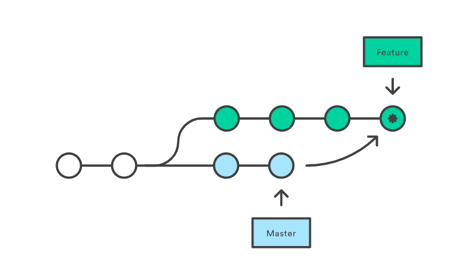
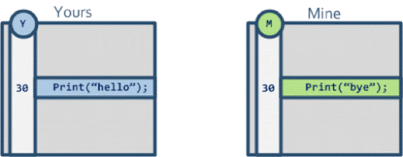
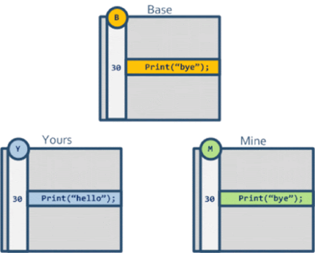
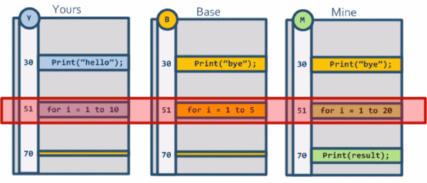
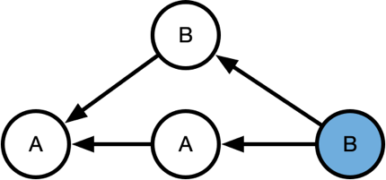
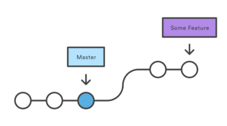
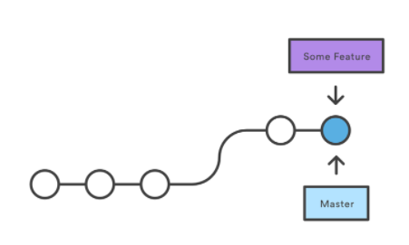
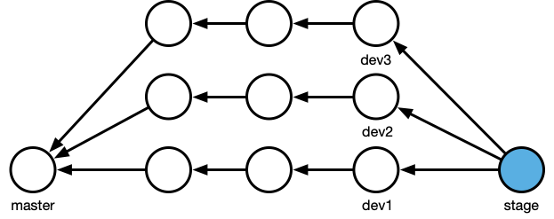

# Merge

::: tip
git merge -s <策略名字>
:::

- 使用` git merge `来做分支合并。
- 将`master`分支合并到`feature`分支上，会`新增`一个`commit`节点来记录这次合并
- `Git`会有很多合并策略，其中常见的是`Fast-forward`、`Recursive `、`Ours`、`Theirs`、`Octopus`
- 默认`Git`会帮你自动挑选合适的合并策略，如果你需要强制指定，使用`git merge -s <策略名字>`

## three-way-merge
- 二向合并，git不知道怎么合并

- 三项合并
```bash
int ll_merge(mmbuffer_t *result_buf,
         const char *path,
         mmfile_t *ancestor, const char *ancestor_label,
         mmfile_t *ours, const char *our_label,
         mmfile_t *theirs, const char *their_label,
         const struct ll_merge_options *opts)
```

- 自动帮合并这两个文件为 Print(“hello”)
- 复杂点，出现冲突


## Recursive-three-way-merge
- 递归寻找路径最短的唯一共同祖先节点，然后以其为`base`节点进行递归三向合并
- B和A待合并，往上走A是两个的`共同祖先`，确定A为base，`B为修改`，`commit`取`B`

- 但更复杂的时候，Git在寻找路径最短的共同祖先节点时，如果满足条件的祖先节点不唯一，那么Git会继续递归往下寻找直至唯一
- Git只是使用这些策略尽量的去帮你`减少冲突`，如果冲突不可避免，那Git就会提示冲突，需要手动解决

## Fast-forward 
- `Fast-forward`是Git在合并两个没有分叉的分支时的默认行为

- 将master分支的指向移动到`最后一个`commit节点上


## Ours & Theirs
- `ours` 当前
- `git merge -s ours dev`

- `theirs` 需要被合并的分支


## Octopus
- `git merge`两个以上分支时的默认行为
- 用一个合并节点将两个以上的`commit`全部合并进来
- `dev1`分支上执行`git merge dev2 dev3`



