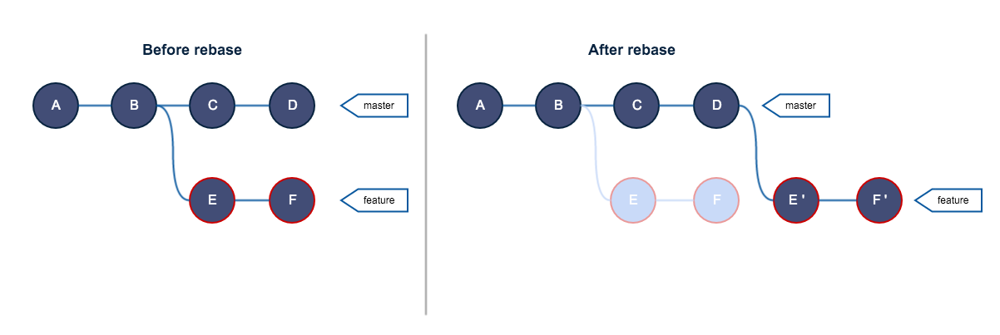

# Merge and Rebase

- 使用` git merge `来做分支合并。
- 将`master`分支合并到`feature`分支上，会新增一个`commit`节点来记录这次合并
- `Git`会有很多合并策略，其中常见的是`Fast-forward`、`Recursive `、`Ours`、`Theirs`、`Octopus`
- 默认`Git`会帮你自动挑选合适的合并策略，如果你需要强制指定，使用`git merge -s <策略名字>`
## Fast-forward

- 将master分支的指向移动到最后一个commit节点上

## git rebase
::: tip
git-rebase: Forward-port local commits to the updated upstream head  
        — git doc
:::
- 其与git merge的最大区别是，他会更改变更历史对应的commit节点。

