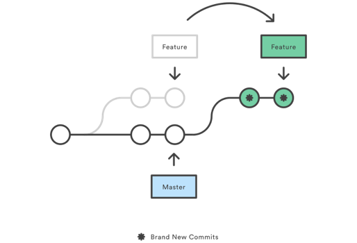

# Rebase

::: tip
git-rebase: Forward-port local commits to the updated upstream head  
        — git doc  
git rebase will take the commits on this branch and "move" them so that their new "base" is at the point you specify.
:::
- 其与`git merge`的最大区别是，他会更改变更历史对应的`commit`节点。

- 新增两个全新的commit代替feature分支中的commit节点。其原因是新的commit指向的parent变了，所以对应的SHA1值也会改变，所以没办法复用原feature分支中的commit

