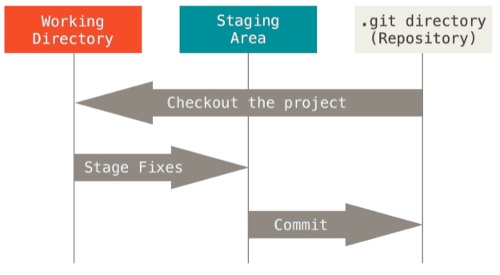

# Git series 

::: tip
There are a lot of posts out there about learning the basic commands of git, this is not one of them. What I’m going to try here is a different approach.  
:::

- Linux之父 `Linus Torvalds` 继Linux内核后奉献给全世界程序员的第二个礼物

- `工作区（WORKING DIRECTORY）`: 直接编辑文件的地方，肉眼可见直接操作；
- `暂存区（STAGIN AREA）`：数据（快照）暂时存放的地方；
- `版本库（GIT DIRECTORT(RESPOSITORY)）`：存放已经提交的数据，push 的时候，就是把这个区的数据 push 到远程git仓库了。
- `git add`就是将工作区的修改缓存在`暂存区`
- `git commit`就是将暂存区的数据快照提交到`本地库`

## 炫技
- graph list `git log --graph --abbrev-commit --decorate --all --oneline`
- 抹除commit黑历史 `git reset --soft ur_commit` 保留修改的同时，ur_commit之后的历史抹掉
- 回滚 `git reset --hard [_commit_]`

## 参考
- [daolf-git-series](https://www.daolf.com/tags/git/)
- [git-with-d3](http://onlywei.github.io/explain-git-with-d3/#commit%E3%80%82)
- [lzane-git](https://www.lzane.com/tech/git-internal/)
- [git-doc](https://git-scm.com/doc)
- [图解git](https://tonybai.com/2020/04/07/illustrated-tale-of-git-internal-key-concepts/)
- [git基本介绍](https://www.cnblogs.com/kisun168/p/11408346.html)