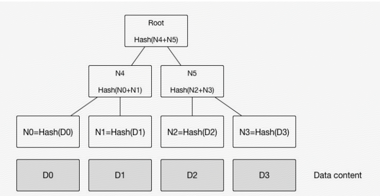

# Git series 

::: tip
There are a lot of posts out there about learning the basic commands of git, this is not one of them. What I’m going to try here is a different approach.  
:::

- Linux之父 `Linus Torvalds` 继Linux内核后奉献给全世界程序员的第二个礼物


- `工作区（WORKING DIRECTORY）`: 直接编辑文件的地方，肉眼可见直接操作；
- `暂存区（STAGING AREA）`：数据（快照）暂时存放的地方；
- `版本库（GIT DIRECTORT(RESPOSITORY)）`：存放已经提交的数据，push 的时候，就是把这个区的数据 push 到远程git仓库了。
- `git add`就是将工作区的修改缓存在`暂存区`
- `git commit`就是将暂存区的数据快照提交到`本地库`

## Technical-term

### SHA-1
- git 为每一个实体生成一个160位的散列值，通常使用40个字符长度的16进制字符串表示 `头信息（Header`）和` 校验和(checksum)`
  - 一个文件对应一条内容
  - The subdirectory is named with the `first 2 characters` of the SHA-1, and the `filename is the remaining 38 characters`
- 散列碰撞（当不同的内容产生了相同的 SHA1）：
  - 几乎不会出现散列碰撞情况(相同SHA1，出现冲突)
  - 通常情况下你不需要担心该散列值会产生碰撞，对于 160 位数，你有 2160 或者大约 1048 种可能的 SHA1 散列值。
- git 是`基于内容`来生成 `SHA1`
  - 对应相同的内容得到的永远是相同的 SHA1


### SNAPSHOT
::: tip
Every time you commit, or save the state of your project in Git, it basically takes a picture of what all your files look like at that moment and stores a reference to that snapshot.
::: 
- 当你删除一个文件后，文件原来所占的磁盘空间并不是被清空，而是被文件系统标记为“已废弃，可修改”的状态，快照的作用就相当于将旧文件所占的空间保留下来，并且保存一个引用，而新文件中会继续使用与旧文件内容相同部分的磁盘空间，不同部分则写入新的磁盘空间
- 快照并不是这次 `commit` 时项目中所有文件的拷贝，而是一种索引，通过这个索引可以找到这次 commit 时的所有文件
- 而 git 在每次 commit 时对项目中所有文件进行扫描，如果某文件发生变化则会对应生成一个新的文件 blob，记录当前 commit 时该文件的文件内容，而文件名是对文件内容的一次 SHA-1 运算得到的 40 位字符串，如果该文件内容没有发生变化，就不会产生新的 blob 对象（因为相同内容的 SHA-1 hash值唯一）
- 快照就是记录所有这次提交 commit 时 blob 文件名 SHA-1 hash 字符串`集合`，所以就可以通过某次 commit 的快照找到当时所有文件的 blob 对象文件 hash 字符串集合从而找到所有的文件，加载所有文件后就还原到了当时 commit 的项目状态。


### Merkle Tree
``` bash
$  git cat-file -p master^{tree}  //master 分支上最新的提交所指向的树对象
100644 blob e69de29bb2d1d6434b8b29ae775ad8c2e48c5391    1.text
100644 blob e69de29bb2d1d6434b8b29ae775ad8c2e48c5391    2.txt
```
- object是不可变的，`默克尔树(Merkle Tree)`判断变化
  - 默克尔树是一类基于哈希值的二叉树或多叉树，其叶子节点上的值通常为数据块的哈希值，而非叶子节点上的值，是将该节点的所有孩子节点的组合结果的哈希值。默克尔树的特点是，底层数据的任何变动，都会传递到其父亲节点，一直到树根。
  
  - git会自底向上逐一创建这些新对象
  - git也只是根据最新内容`创建`一个新的blob对象，而不是修改或替换掉之前对应的blob对象。


## 炫技
- graph list `git log --graph --abbrev-commit --decorate --all --oneline`
- 抹除commit黑历史 `git reset --soft ur_commit` 保留修改的同时，ur_commit之后的历史抹掉
- 回滚 `git reset --hard [_commit_]`

## 参考
- [daolf-git-series](https://www.daolf.com/tags/git/)
- [git-with-d3](http://onlywei.github.io/explain-git-with-d3/#commit%E3%80%82)
- [lzane-git](https://www.lzane.com/tech/git-internal/)
- [git-Internals](https://git-scm.com/book/en/v2/Git-Internals-Plumbing-and-Porcelain)
- [git-doc](https://git-scm.com/doc)
- [图解git](https://tonybai.com/2020/04/07/illustrated-tale-of-git-internal-key-concepts/)
- [git基本介绍](https://www.cnblogs.com/kisun168/p/11408346.html)