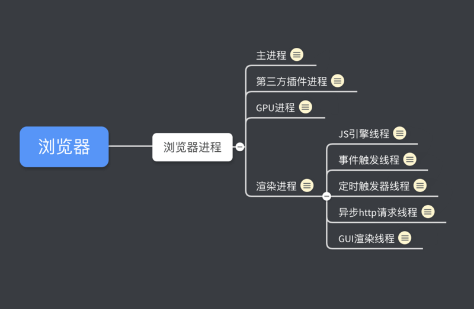

# 浏览器相关

- [How browsers work](http://taligarsiel.com/Projects/howbrowserswork1.htm)

## 进程和线程
- 打开浏览器一个进程、打开音乐一个进程
- 进程里面含多个线程、浏览器点击一个线程、切换一个线程 etc
- 但是浏览器是多进程的！进程间互不影响
- chrome浏览器的每个标签页都分别对应一个引擎实例，每个标签页都是一个独立的进程

## 浏览器渲染流程
- 解析 `HTML` 文件,构建 `DOM tree` ,**同时**浏览器主进程负责下载 `样式/css` 文件,生成` style rules`
  - ps: html解析遇到js会被暂停哈，并且css不完整也不可以，所以要等css下载完了dom tree构建才会继续
  - 浏览器将二进制转换为html字符串
  - 生成tokens
  - 通过指针确定节点的关系，构建nodes
  - 最后通过node指针构建dom tree
- `style rules` 结合 `DOM tree` 合并成 `Render tree` 渲染树 
  - 根据选择器提供的信息对dom tree遍历，将rule附着到dom tree上
- `layout` 阶段为每个节点分配确切坐标
- 浏览器**主进程**将默认的图层和复合图层交给` GUI渲染线程`, GUI渲染线程 会`遍历` Render tree，再将各个图层合成（composite）,最后绘制（paint）出页面
- 渲染过程中遇到 script会停止渲染， `GUI渲染线程` 与 `JavaScript引擎`为`互斥`的关系

## JS 阻塞页面加载
- 为了ui绘制元素不冲突、 GUI 渲染线程与 JavaScript 引擎为`互斥`的关系
- 当浏览器在执行 JavaScript 程序的时候,GUI 渲染线程会被保存在一个`队列`中,直到 JS 程序执行完成,才会接着执行
- 首屏渲染不要加载js， sript要放在body底部 ，defer/async
- 浏览器遇到html、style、和js，会优先css构建，再js，最后才是dom tree

## defer 和 async 的区别
- 没有以上、浏览器立即执行、不过以上都仅适用于外部脚本

- 允许`<script>`异步加载, 不会阻塞 dom tree生成
    - `async` 表示如果已经加载好了，就会开始执行，这时候阻塞html解析也没办法捏～
      - 可能在 `DOMContentLoaded` 之前之后执行，肯定在load之触发之前
    - `defer` 下载脚本会等到html解析完了再执行，然后触发 `DOMContentLoaded`
- es6 module
    - `type = module`

## CSS会阻塞页面渲染吗
如果有js脚本的话，会，没有的话，不会

## 浏览器的回流与重绘
- `回流` 元素的尺寸、结构、或某些属性发生改变时,浏览器`重新渲染`部分或全部文档的过程
  - 首次渲染、页面大小改变、元素尺寸、字体大小、删除添加dom、激活伪类
- `重绘` 当页面中元素样式的改变并不影响它在文档流中的位置时（例如：color、background-color、visibility 等）,浏览器会将新样式赋予给元素并`重新绘制`它
- 回流必将引起重绘,重绘不一定会引起回流
- 如何避免？
  - 避免使用 table 布局。
  - 避免设置`多层`内联样式。
  - 将动画效果应用到 position 属性为 absolute 或 fixed 的元素上。
  - 避免使用 CSS 表达式（例如：calc()）。
  - 避免频繁操作样式,最好一次性重写 style 属性,或者将样式列表定义为 class 并一次性更改 class 属性。
  - 避免频繁操作 DOM
  - display: none,操作结束后再把它显示出来。因为在 display 属性为 none 的元素上进行的 DOM 操作不会引发回流和重绘。
  - 对具有复杂动画的元素使用绝对定位,使它脱离文档流,否则会引起父元素及后续元素频繁回流。

## 内存泄漏
- **闭包不是内存泄漏的原因！** 
  - 变量放在闭包里和放在全局作用域对内存的影响是一致的
  - 而且闭包肯定也会留个外部会调用的接口，本身也不是不可以被垃圾回收
  - 定时器/事件监听器/请求/回调都是闭包
- 只有因为你手滑写了无限循环
- a和b循环引用
- 未清理的定时器
- 未清理的dom元素引用