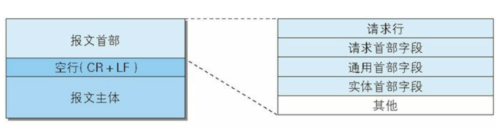
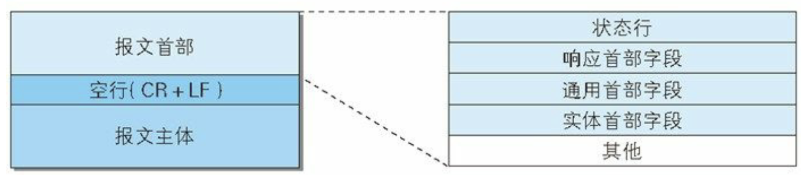
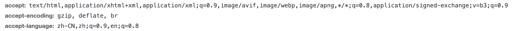

# 网络相关


## HTTP报文的内容
### 请求报文

- 请求行 (url和http版本)

### 响应报文

- 状态行（http版本 响应状态码 原因短语）


## http首部相关
通用和实体首部字段是请求和响应都有的
### 请求/响应首部 
#### 请求首部
发请求的时候请求告诉服务器的补充信息啦，很难理解吗
- accept 系列，注意是系列

  - `accept` text/image/audio/video/application/json 返回 `content-type`
  - `accept-charset` 字符集 服务端返回的是 `content-type`
  - `accept-encoding` 压缩方式 gzip/deflate/br 返回 `content-encoding`
  - `accept-language` 返回  `content-language`
#### 响应首部
---
### 通用首部 
- `cache-control`
  - 缓存`请求`指令
  
  - 缓存`响应`指令
  
- `transfer-encoding` 对于不定长的数据传输 用传输编码的方式发送 设为 `chunked`
- `connection` keep-alive/close
---
### 实体首部
- `content-lenth` 应对定长数据

## HTTP
超文本传输协议`HTTP`
- 明文传输，头部不是二进制而是文本形式
- 基于tcp/ip
- 端口为80
- 是无状态的，每次请求都是独立的，需要长连的时候不要保存大量上下文信息
- 半双工

## HTTP1
- http1.0
  - 非持续性连接，负担重，每次请求重新建立tcp
  - 队头堵塞
  - 无host，（host: 请求资源所在的服务器）
  - 无断点续传，要求一次发送整个对象
  - 有缓存策略，if-modified-since/expires
- http1.1
  - 更多缓存策略，etag/if-match/if-none-match
  - range头
  - host头
  - 支持长连接
  - 请求流水线（流水线/非流水线方式-客户端收到响应后才发下一个请求）
    - 流水线：在收到响应报文前能接着发新的请求报文，请求报文一个接一个到达服务端
  - 解决队头堵塞
  - 一个http只能6个tcp连接
  - 默认开启connection:keep-alive

## 队头堵塞
http开启长连接的时候共用一个tcp请求，同一时刻只能处理一个请求，当前请求耗时过长，其他请求就会处于阻塞状态

## HTTP2.0的特性，改进的点
- 二进制分帧传输，也就是全部变成二进制的帧
- 头部压缩
  - hpack算法，建立哈希表，出现过的值通过索引传给对方
  - 整数和字符串哈夫曼编码 索引表尽可能短
- 多路复用，同一服务下只需要用一个连接，节省了连接
  - 一个tcp上多个http请求，connectionid是一样的
  - 设置ID识别，到了服务端再归属
  - massage - stream + id - 重组
- 服务器推送，一次客户端请求服务端可以多次响应，当tcp建立后，服务器可以将请求到的东西的相关也一并返回
- 设置请求优先级

## HTTP3
- 2018年发布，基于谷歌的QUIC
- 底层使用udp代码tcp协议
- 解决了队头阻塞问题，同样无需握手,性能大大地提升，默认使用tls加密​。

## HTTPS
```
    基于HTTP协议，通过 SSL 或 TLS 提供加密处理数据、验证对方身份以及数据完整性保护.
    HTTPS协议可以理解为HTTP协议的升级，就是在HTTP的基础上增加了数据加密。
    在数据进行传输之前，对数据进行加密，然后再发送到服务器。
    这样，就算数据被第三者所截获，但是由于数据是加密的，所以你的个人信息让然是安全的。
```
- HTTP+SSL = `HTTPS`超文本传输安全协议
  - 对传输数据加密
  - 端口为443
  - 证书、公钥、密钥
  - 费时、证书要钱

## SSL/TLS
- tls (transport layer security) 传输层安全
- ssl (secure sockets layer) 安全套接层
- tls1.0 就等于 ssl3.1
### 加密方式
- 共享密钥加密
  - 加密/解密都会用到不公开的`密钥`，当然加密/解密算法是公开的
  - `共享密钥加密` = `对称密钥加密`（解密和加密方共用同一个密钥）
  - 怎么安全递交是个问题
- 公开密钥加密
  - 解决以上问题
  - 非对称密钥：私有密钥+公开密钥
  - 发送方：使用对方`公开密钥`加密
  - 接收方：用`私有密钥`进行解密
- 混合加密机制（共享+公开）
  - `交换密钥`使用`公开密钥加密`
  - `建立通信交换报文`用`共享密钥加密`
- 数字证书
  - 证明 `公开密钥` 的真实性

### 加密算法

## 状态码
- 1xx 协议处于中间状态，需要后续操作
- 2xx 成功状态
   `204` no content,请求成功但是没有更新的内容
- 3xx 重定向状态，资源位置发生变动，需要重新请求
  - `301` 永久重定向 保存书签了的url已经更新了，提醒客户端也要更新下
  - `302` 临时重定向 保存书签的url临时改变
  - `303` 提醒你应该用get
  - `304` 请求的内容服务器无更新
- 4xx 错误
  - `400` 请求无效
  - `401` 需要认证
  - `403` 服务端已收到但是拒绝执行
  - `404` not found
- 5xx 服务器错误
- `500` 服务器内部错误
- `502` Bad Gateway无效的响应
- `505` 服务器不支持请求的HTTP协议的版本，无法完成处理

## 关于304状态码
- 页面内容更新周期长甚至不更新
- cdn缓存未更新

## http缓存相关
- 请求头/meta标签
- 判断强缓存是否可用，否则一律协商缓存
### 请求相关头部
- 响应：`cache-control`
  - `no-cache` 强制再次认证，不是不缓存的意思
  - `no-store` 不缓存
  - `max-age = 秒` 在xx时间内再次发起请求会用缓存
-  服务端/客户端） `expires` 存在时差问题
- `if-none-match` - `etag`(响应)
- `if-modified-since`（客户端） = time 之后更新 -- `last-modified`(服务端/客户端)
### 强缓存
- 状态码更为灰色代表使用了强制缓存
  - size 列里 `from memory cache` 内存
  - size 列里 `from disk cache` 硬盘
- `cache-control` > `expires`（实体首部）
### 协商缓存
- 由服务器决定是否使用缓存
- 失效 - 重新请求结果 200 新资源
- 生效 - 304，直接从缓存里取
- 客户端 `if-modified-since` - 服务端 `last-modifyed`  h1.0
- 客户端 `if-none-match` - 服务端 `etag` h1.1
- `etag/if-none-match` > `last-modifyed/if-modified-since`

## WebSocket
- 80/443 和http一样
- ws/wss
- 在单个tcp上进行全双工的通信协议，能客户端和服务端之间双向数据传输
- 只需要一次握手（用http），长连接，用来弥补http在持久通信能力上的不足
- 支持二进制和文本
- 没有同源限制
### 应用在
- 即时聊天
- 在线协同
### 没有websocket之前的尝试
以下基于http
- 轮询 定时器哈哈哈哈，反正服务器会响应
- 长轮询 在设定的时间内当前连接不断开，没消息，服务端就等，过了=挂起，占用服务资源
### 原理走一遭
- 先http，服务器同意后建立websocket
- request: get/http1.1 -> sec-websocket-version : 13; connection: upgrade ; upgrade: websocket
- response: http1.1 101 -> switching protocols; upgrade: websocket
- 中途交换key sec-websocket-key <=> sec-websocket-accept
### websocket数据处理
- 库 websocket-node
- 服务端：webpack.on-request -> build connection -> connection.监听message -> connection.close
- 客户端：socket=io.connectic('..') -> socket.emit('yiki',text) -> socket.on('push')
### 断连怎么办
- 心跳包/心跳重连，外部包裹一个重新发起请求的方法，当接收不到的时候重新发起连接
``` 
客户端每隔一段时间，向服务器发送一个心跳包，服务器接收到包以后，字典数据的值都会更新为0；一旦服务端超过规定时间没有接收到客户端发来的包，字典数据将会递增加一，当字典数据的值累计大于等于三，则视为掉线
```

## 怎么处理表单的提交
- post
- application/x-www-form-urlencoded 字符会以url方式编码，&分隔
- multipart/form-data 对于图片等文件上传用这个

### private/public
- 禁止/允许，用于私密性，是否允许代理服务器缓存

## cookies
4kb，携带一些状态
### requeset headers
- 携带cookie
``` a=xxx; b=xxx;```
### response headers
- set-cookie

  - `name=`
  - `expires=` 有效期
  - `path` 服务器的文件目录作为cookie的适用对象
  - `domain` 域名
  - `secure` 仅https
  - `httponly` cookie不能被js脚本访问, 防止xss攻击(document.cookie不能获取)

## TCP/UDP
- 传输层协议
- 都能复用和分用，有检错功能
### TCP
- 面向连接
- 面向`字节流`
- 提供可靠的服务
- 只能一对一
- 全双工
### tcp滑窗机制
- 流量控制
### tcp拥塞控制
- 即慢开始
- 拥塞避免
- 快重传
- 快恢复
#### 三次握手 
- 建立连接，确认发送和接收的能力
- `SYN=1` 建立连接 ；`FIN=1` 请求断开； `ACK=1` 数据信息确认
- 交换三个报文段（ `SYN/ACK`同步位，`seq`初始序号，`ack`确认号）
```
  client -- -->       SYN=1; seq=x              -->  server
  client -- <--  SYN=1; ACK=1; ack=x+1; seq=y   <--  server
  client -- -->    ACK=1; ack=y+1; seq=x+1      -->  server
```
#### 四次挥手关闭连接
-（连接释放）(`FIN/ACK`同步位 `seq`初始序号，`ack`确认号)
```
  client -- -->     FIN=1; seq=u                -->  server
  client -- <--     ACK=1; ack=u+1; seq=v       <--  server
                  还能继续传输数据
  client -- <--   FIN=1; ACK=1; seq=w; ack=u+1  <--  server
  client -- -->     ACK=1; seq=u+1; ask=w+1     -->  server
```
### `UDP`
- 尽最大努力交付
- 面向`报文（数据报）`
- 无拥塞控制
- 一对一，一对多，多对多交互通信
- 首部开销小

## 请求方式
- `head`：类似于get请求，只不过返回的响应中没有具体的内容，用户获取报头
- `options`：允许客户端查看服务器的性能，比如说服务器支持的请求方式等等。
- `fetch/put`
    - 第一次是option 询问是否支持
    - 第二次是真正的请求


## get和post的区别
- 缓存：get 会被浏览器主动缓存，留下历史记录，post不会
- 编码：get只能url编码，接收ascll字符，post没有限制
- 参数：写在url上，不安全，post放在请求体，适合敏感信息


## cookies、localstorage、sessionstorage的区别
【还有一道关于它们的场景题】

## 网络攻击的类型
- 会话劫持
- 跨站点脚本
- 跨站点请求伪造

## 计算机网络五层协议
- 应用层 ftp/smtp http
  - 表示层（旧七层）数据加密 压缩 转换
  - 会话层（旧七层）连建的建立和终止
- 运输层 tcp/udp 控制数据传输的可靠性
- 网络层  ip 通过路由找到网络
- 数据链路层 帧 确定主机 交换机 mac地址
- 物理层 比特

## ssr怎么做的，为什么要ssr
- 服务器端渲染
- 服务端直接通过http返回html给客户端
- 易于seo
  - js解析是异步的，爬虫等不了，window.onload也只是说资源加载完了而已
- 耗费服务端资源
- 首屏渲染

## cookie跨域吗
## token安全

## url地址到返回页面中间发生了什么 
- 如果没有CDN
    - 浏览器要将域名解析为 IP 地址，所以需要向本地 DNS 发出请求。
    - 本地 DNS 依次向根服务器、顶级域名服务器、权限服务器发出请求，得到网站服务器的 IP 地址。
    - 本地 DNS 将 IP 地址发回给浏览器，浏览器向网站服务器 IP 地址发出请求并得到资源。
- 有CDN  
见性能优化-CDN相关
- 找到服务端三次握手，建立tcp/ip，发起http请求
- 开始返回资源走服务器渲染过程
