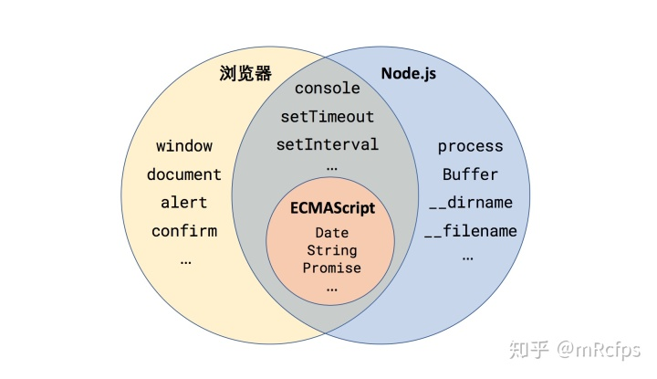

# Node.js

::: tip 就当俺是一门语言～
其实只是一种js的运行环境
:::

- node 的全局对象


## support 
- [officail learn](https://nodejs.dev/learn)
- [上手 Node.js](https://zhuanlan.zhihu.com/p/97413574)

## Node core 
- an open-source and cross-platform JavaScript `runtime environment`
- runs the `V8` JavaScript engine
- A Node.js app runs in a `single process`, without creating a new thread for every request 单进程哈
- written using `non-blocking` paradigms
- provides a set of `asynchronous I/O primitives` in its standard library that prevent JavaScript code from `blocking` 
-  `resume` the operations when the response comes back

## 初探，搞个服务器
- new a file named `app.js`
``` js
const http = require('http');
const hostname = '127.0.0.1';
const port = 3000;

// a request (an http.IncomingMessage object) 
// a response (an http.ServerResponse object).
const server = http.createServer((req, res) => {
  res.statusCode = 200;
  res.setHeader('Content-Type', 'text/plain');
  res.end('Hello World'); // actually is process.stdout.write('Hello World!\n')
});

server.listen(port, hostname, () => {
  console.log(`Server running at http://${hostname}:${port}/`);
});
```
- run your web server using `node app.js`
- Visit http://localhost:3000 
- you will see a message saying "Hello World".