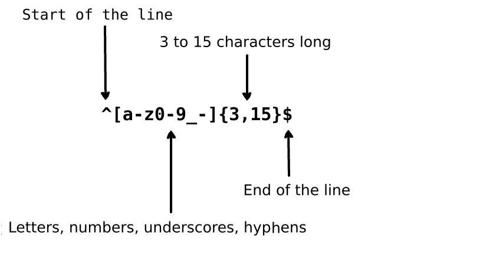
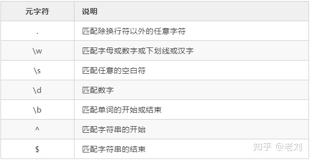

# Regular Expression

::: tip
`regex` or `regexp`  
 A `regular expression` is a group of characters or symbols which is used to find a specific pattern in a text
:::
- [regex-test](https://regex101.com)
- [learn-regex](https://github.com/zeeshanu/learn-regex)
- [regexlearn](https://regexlearn.com/learn)
## The Basic
- `left` to `right`
- `case-sensitive`
- Demo
  - for `john_doe`,`jo-hn_doe`  
  - BUT It does not match `Jo` ( uppercase, too short)

- Basic Matchers
 
>  "the" => The fat cat sat on `the` mat  
> "The" => `The` fat cat sat on the mat  
> ".ar" => The `car par`ked in the `gar`age  

## Meta Characters
- building `blocks` of regular expressions
- written inside `brackets`

|Meta character|Description|
|:----:|----|
|.|Period matches `any` single character except a line break (换行符)|
|[ ]|Character class. Matches any character `contained between` the square brackets|
|[^ ]|Negated character class. Matches any character that is `not contained between` the square brackets|
|*|Matches `0` or more `repetitions` of the preceding symbol|
|+|Matches `1` or more `repetitions` of the preceding symbol|
|?|Makes the preceding symbol `optional`|
|{n,m}|Braces. Matches at least `"n"` but not more than `"m"` repetitions of the preceding symbol|
|(xyz)|Character group. Matches the characters xyz in that `exact` order|
|&#124;|Alternation. Matches `either` the characters `before` or the characters `after` the symbol|
|&#92;|`Escapes` (转义) the next character. This allows you to match reserved characters `[ ] ( ) { } . * + ? ^ $ \ &#124;`|
|^|Matches the `beginning` of the input|
|$|Matches the `end` of the input|