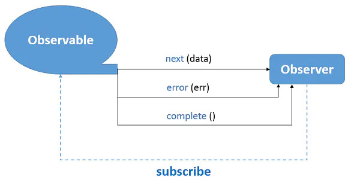
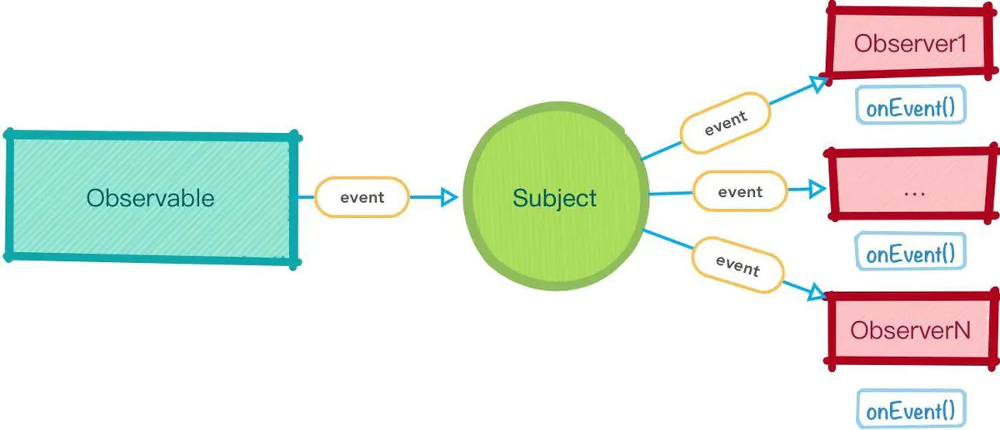

# rxjs Learnning

::: tip Think of RxJS as Lodash for events (流）! 
:)
 RxJS is a library for composing asynchronous and event-based programs by using observable sequences
:::

## Support 
- [Official docs](https://rxjs.dev/guide/overview)

## Observable
- `Observable`  invokable `collection` of `future` values or events
- `Observer`  collection of `callbacks` that knows `how` to listen to values `delivered` by the - Observable.
- `Subscription`  execution of an Observable, is primarily useful for `cancelling` the execution.
- 

### The code
``` js
import { Observable } from "rxjs";

// creat a stream
const stream = new Observable(subscriber => {
  setTimeout(() => {
    subscriber.next([1, 2, 3]);
  }, 500);
});

// how to handle the datas of your stream, is observer
const observer = {
  complete: () => console.log("done"),
  next: v => console.log(v),
  error: () => console.log("error")
};

// excution by subscribe
const subscription = stream.subscribe(observer);

// stop
setTimeout(() => {
  subscription.unsubscribe();
}, 1000);

```

## Operators
- `Operators` pure `functions` that enable a functional programming style of dealing with collections with operations like `map`, `filter`, `concat`, `reduce`, etc.
- `Subject` is an `EventEmitter`, and the only way of `multicasting` a value or event to `multiple` Observers.
- `Schedulers` centralized `dispatchers` to control concurrency, allowing us to coordinate when computation happens on e.g. `setTimeout` or `requestAnimationFrame` or others.
- 
### code
``` js
import { Subject } from "rxjs";

// 创建subject
const subject = new Subject();

// 订阅一个observer
subject.subscribe(v => console.log("stream 1", v));
// 再订阅一个observer
subject.subscribe(v => console.log("stream 2", v));
// 延时1s再订阅一个observer
setTimeout(() => {
  subject.subscribe(v => console.log("stream 3", v));
}, 1000);
// 产生数据1
subject.next(1);
// 产生数据2
subject.next(2);
// 延时3s产生数据3
setTimeout(() => {
  subject.next(3);
}, 3000);

//Scheduler
stream.observeOn(Rx.Scheduler.async) 
```


## 题外话
```
在现在es6/ts大行其道的前端来说，rxjs能解决的场景大部分都已经用promise代替
可能是我自己的问题吧，写ng的时候也用得不多
包括一开始我组长用过rxjs来写一些状态管理，但是在vuex/redux下rxjs有点鸡肋
如果非要说用的话
可以用在
1.websocket（对websocket subsribe/unsubscribe ）和
2.异步数据过滤上(pip+take(times)) 

```