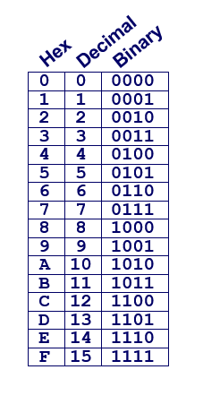
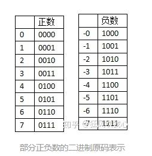
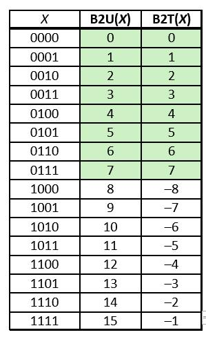

# Infomation Storage

::: tip 
数据表示 - 不同的数据是如何存储与表示的  
      —— 很多时候计算机中也没有什么『准确的结果』，更多的是『可以表示的结果』
:::
- 理解内存中数据的保存形式，以及这种方式的好处以及限制
- 区别整型和浮点数的表达机制
- 简单理解溢出

## Base
- x^2 ≥0 but what happen about this in gdb(32)
  - Integer NO
  - Float YES
  ``` 
  (gdb) print 5000*5000
  $2 = 25000000
  (gdb) print 50000*50000
  $3 = -1794967296
  (gdb)
  ```
- But All Float ... Why not?
  - 因为float/double会损失部分精度
  ```
  (lldb) print (1e20 + -1e20) + 3.14
  (double) $0 = 3.1400000000000001
  (lldb) print 1e20 + (-1e20 + 3.14)
  (double) $1 = 0
  ```

## Bit
   
- 计算机不认识你写的是什么，它只认识`0`和`1`，俗称比特流，和模拟电路有关
- `Byte = 8 bits`
- Binary `00000000 ~ 111111112`
- Decimal: `0 ~ 255`
- Hexadecimal `00 ~ FF`, prefix:`0x~`

## Integer
- 假设字长(word size)为 w，那么二进制向十进制的转换分别是：
- `unsigned-无符号数`，只能表示非负数
```
  1     1     0    1
  2^3  2^2   2^1  2^0
  8     4     2     1
  8+4+1=13 

```
- `signed-有符号数` 
  - 原码表0有正负，负数用最高位做符号位 `-`占一位+3的原码  
  
  - `-3`
    - 原码 1011
    - 反码 1100 （除了符号位取反）
    - 补码 1101 （反码+1）
  - 但是原码 `-3 + 3`
  ```
  1 0 1 1 -3
  0 0 1 1  3
  --------------
  1 1 1 0  -6 有符号位引起的错误
  ```
  - 为了消掉零的两个表示，和运算时候判断符号位的复杂
  - 所以计算机都是用`补码-Two’s Complement`，补码从 8 开始 变  
  
  - 符号位中，0 表示非负数，1 表示负数，计算权重的时候
  ```
   1     1     0    1
  -2^3  2^2   2^1  2^0
  -8     4     2     1
  -8+4+1=-3 

  ------------------ 补码加法
    1101 -3
    0011  3
   ------
   10000 截断 为 0000 = 0 

  ```
  - unsinged overflow
    - 如果两个 w 位的数字相加，结果是 w+1 位的话，那么就会丢弃掉最高位，实际上是做了一个 mod 操作
    - （公式为` s = UAddw(u,v)= u+v mod 2^w`）
  - singed overflow
  - `正溢出-positive overflow` 和 `负溢出- negative overflow`两种
  - 正溢出就是数值太大把原来为 0 的符号位修改成了 1，反而成了负数
  - 负溢出是数值太小，把原来为 1 的符号位修改成了 0，反而成了正数
 
## Float
- IEEE 浮点数标准
